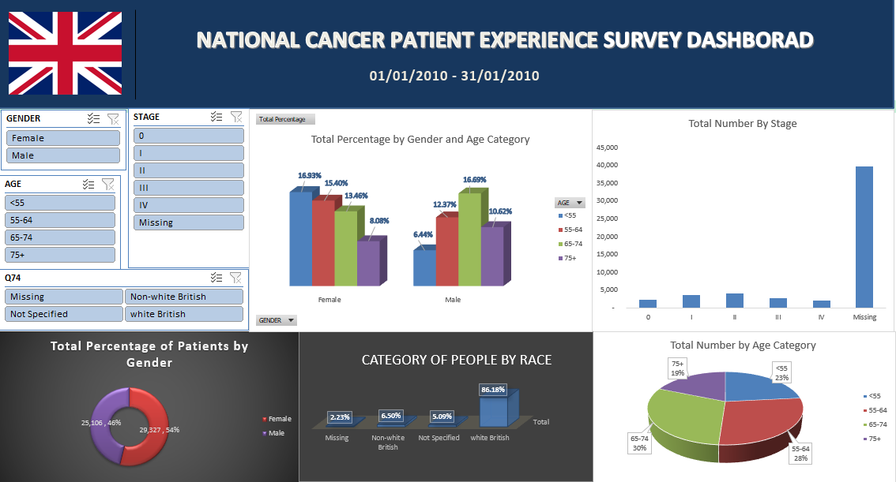
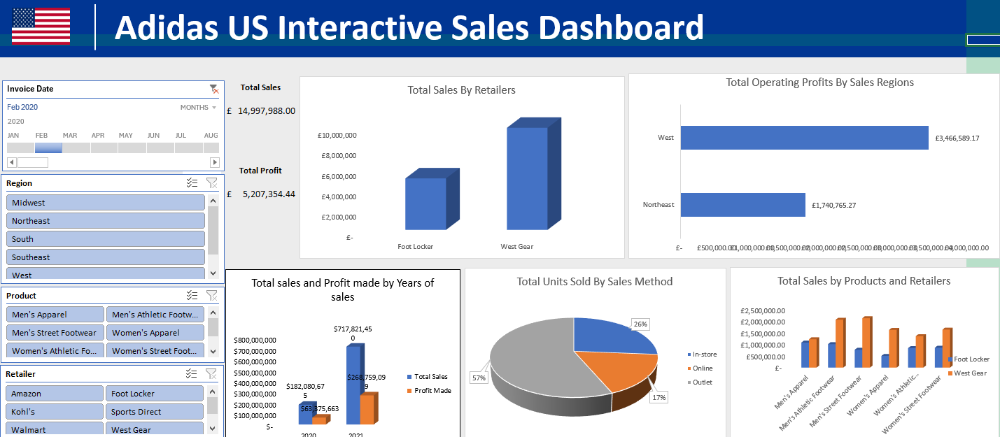

  # Project 1

**Title:** [Online Retail Transactions Interactive Dashboard](https://github.com/ibu06/ibu06.github.io/blob/main/Retail_Transaction%20Project.xlsb)

**Tools Used:** Microsoft Excel(Pivot tables, Pivot charts, Timelines, Slicers, filters)

**Project Description:** The Online Retail Transaction Dashboard provides a comprehensive analysis of retail sales performance across different product categories and payment methods. The dashboard highlights key metrics such as total revenue, transaction distribution, and customer purchasing behaviour, enabling stakeholders to identify trends, compare category performance, and evaluate payment preferences.

The total recorded sales amount to £24.83 million, indicating a substantial volume of transactions within the dataset. The dashboard integrates multiple visualisations to present insights on product category performance, revenue distribution, and payment method usage.

**Key Findings:** 
- Total revenue reached £24.83M, indicating strong business performance.
- Revenue is evenly distributed across all product categories.
- Books generate the highest revenue despite not having the highest transaction count, indicating higher average order values.
- Clothing records the highest number of transactions, reflecting high customer demand.
- Payment methods are evenly utilised, with a slight preference for PayPal, indicating a shift towards digital payments.

**Business Recommendations:**
- Focus on high-revenue categories like Books for upselling opportunities.
- Improve performance of Home Decor through targeted promotions.
- Leverage high transaction volume in Clothing to increase cross-selling.
- Enhance digital payment systems to align with customer preferences.

**Dashboard Overview:** This dashboard provides an analysis of online retail transactions, focusing on total sales, product category performance, and payment method distribution. It highlights key trends in customer purchasing behaviour and revenue generation across different product categories.

---

# Project 2

**Title:** [National Cancer Patient Experience Survey Dashboard](https://github.com/ibu06/ibu06.github.io/blob/main/Cancer_Patient_Survey.xlsx)

**Tools Used:** Microsoft Excel(Pivot tables, Pivot charts, Timelines, Slicers, filters)

**Project Description:** The National Cancer Patient Experience Survey Dashboard presents a comprehensive analysis of patient responses collected during Wave 1 (January–March 2010). The dataset captures key demographic and clinical variables, including age, gender, cancer stage, ethnicity, and diagnostic pathways, providing valuable insights into the characteristics of cancer patients and their interaction with healthcare services.

This analysis aims to explore patterns in patient distribution, identify demographic disparities, and evaluate the completeness and reliability of clinical data. By integrating multiple dimensions of patient information, the dashboard supports a deeper understanding of how different population groups experience cancer diagnosis and care within the healthcare system.

**Key Findings:** 
- The majority of patients fall within the 55–74 age group, confirming higher cancer prevalence among older populations.
- A significant proportion of data is missing for cancer staging, indicating major data quality issues.
- Gender distribution shows higher female representation overall, with males dominating older age groups.
- Ethnicity data is heavily skewed towards White British patients (86%), suggesting underrepresentation of minority groups.
- The dataset reveals potential disparities in healthcare access and reporting across demographic groups.

**Recommendations:**
- Improve data collection processes for cancer staging to enhance analytical accuracy.
- Focus screening and prevention programmes on high-risk age groups (55–74).
- Implement targeted strategies to improve healthcare access for underrepresented ethnic groups.
- Develop gender-specific health awareness and screening initiatives.
- Strengthen data governance and reporting standards within healthcare systems.
  
**Dashboard Overview:** The National Cancer Patient Experience Survey Dashboard provides an analytical overview of patient responses collected between January and March 2010. The dashboard explores patient demographics and clinical characteristics, including gender, age groups, cancer stage, and ethnicity, to identify patterns in patient distribution and experience.
The dashboard enables healthcare stakeholders to understand population trends, disparities, and potential inequalities in cancer diagnosis and care, supporting data-driven decision-making in improving patient outcomes and healthcare delivery.

---

# Project 3

**Title:** [Adidas US Interactive Sales dashboard](https://github.com/ibu06/ibu06.github.io/blob/main/Adidas_Dashboard_Project.xlsx)
**Tools Used:** Microsoft Excel(Pivot tables, Pivot charts, Timelines, Slicers, filters, sum range,

**Project Description:** The Adidas US Sales Performance Dashboard presents a comprehensive, multi-dimensional analysis of retail sales operations across the United States. This project leverages transactional sales data to evaluate key business performance indicators, including revenue generation, profitability, regional performance, product category contribution, and sales channel effectiveness.

The primary objective of this analysis is to uncover data-driven insights that inform strategic decision-making, optimise sales performance, and identify growth opportunities across different market segments. By integrating data across retail partners, geographic regions, product categories, and distribution channels, the dashboard provides a holistic view of business operations and enables stakeholders to assess both macro-level trends and granular performance metrics.

**Key Findings:** 
- Total sales reached £14.99M with a strong profit margin of approximately 35%.
- West Gear is the top-performing retailer, contributing the highest share of revenue.
- The West region generates the highest operating profit, indicating regional performance imbalance.
- Outlet sales dominate (57%), while online sales contribute the least (17%).
- Sales and profit show a positive growth trend over time.

**Recommendations:**
- Strengthen partnerships with high-performing retailers like West Gear.
- Invest in underperforming regions to balance revenue distribution.
- Expand e-commerce channels to increase online sales.
- Diversify sales channels to reduce reliance on outlet stores.
- Optimise product strategies to maximise revenue across categories.

**Dashboard Overview:** This dashboard provides a comprehensive analysis of Adidas retail sales performance across the United States, focusing on revenue generation, profitability, regional performance, product categories, and sales channels. The dataset captures transactional sales data segmented by retailers, regions, product types, and sales methods, enabling a multi-dimensional evaluation of business performance.

The objective of this analysis is to identify key revenue drivers, profitability trends, regional disparities, and customer purchasing behaviours, thereby supporting data-driven decision-making for sales optimisation and strategic growth.

The dashboard integrates interactive filters such as date, region, product category, and retailer, allowing dynamic exploration of sales patterns and operational performance.

---

# Project 4
**Title:** NHS England Patients Outcomes and Cost Analysis (2024-2025)

**Project Description:** This project analyses a UK NHS-style patient dataset which covers the period from 2024 to 2025. The dataset captures hospital activities across NHS regions in England, including patient demographics, diagnosis groups, admission types, referral sources, waiting times, length of stay, treatment costs, and outcomes. The aim of the project is to use SQL to identify operational trends, patient outcome patterns, and cost drivers across NHS Trusts and hospitals.
This portfolio project is designed to demonstrate practical SQL skills in a healthcare context while showing the ability to translate raw data into insights relevant to healthcare delivery, service efficiency, and patient outcomes.

The objectives of the project are to analyse patient activity across NHS regions, trusts, and hospitals; compare waiting times and length of stay across diagnosis groups; evaluate treatment costs by diagnosis, region, and outcome; examine patient outcomes by age group and gender; and identify referral and admission patterns that may affect operational pressure.
  
**SQL Code:** [SQL Queries](https://github.com/ibu06/ibu06.github.io/blob/main/nhs_patients_data.sql)
 
**SQL Skills Used:**
 - Data retrieval using SELECT and filtering with WHERE
 - Aggregation using COUNT, SUM, and AVG
 - Grouping and segmentation using GROUP BY
 - Sorting results with ORDER BY
 - Conditional logic using CASE WHEN
 - Date functions for time-based analysis
 - Calculation of metrics such as averages and percentages
 - Data transformation for analytical insights
 
 **Technology used:** SQL server

 **Key Insights:**
  - Certain diagnosis groups are likely to drive higher average treatment costs and longer stays, indicating greater resource demand.
  - Emergency admissions can reveal which NHS trusts are under the greatest operational pressure.
  - Differences in waiting times across diagnosis groups may highlight service bottlenecks.
  - Outcome patterns across age groups can help identify more vulnerable patient populations.
  - Referral source analysis can show whether demand is driven more by GPs, consultants, A&E, or screening programmes.

 **Recommendations:**
  - Prioritise capacity planning in trusts with high emergency admission volumes.
  - Review pathways for diagnosis groups with longer waiting times.
  - Investigate hospitals with extended average length of stay for possible discharge delays or complexity of care.
  - Use referral source trends to improve service planning and patient flow.
  - Focus preventive and early intervention strategies on high-risk groups with poorer outcomes.

